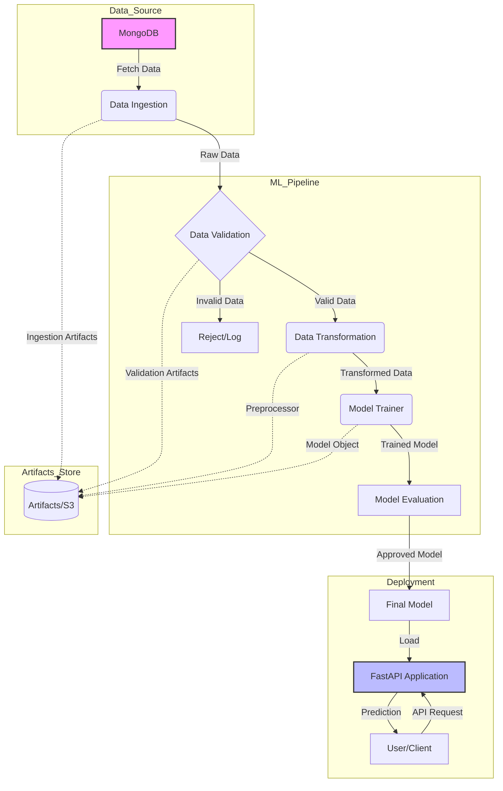

# Network Security MLOps Project


A comprehensive Machine Learning Operations (MLOps) solution aimed at enhancing network security by detecting phishing attempts. This project orchestrates a robust end-to-end ML pipeline encompassing data ingestion, validation, transformation, model training, and scalable deployment using key modern technologies.

## 🏗️ Architecture

The system follows a modular architecture designed for scalability and maintainability.



## 🚀 Key Features

- **Data Ingestion**: Seamless extraction of network data from MongoDB sources.
- **Data Validation**: Rigorous schema checks and data drift detection to ensure data quality.
- **Data Transformation**: Automated preprocessing pipelines to convert raw data into model-ready formats.
- **Model Training**: Modular training component supporting various algorithms with experiment tracking.
- **MLOps Integration**: Integrated with **MLflow** and **DagsHub** for experiment tracking and model registry.
- **Deployment**: RESTful API service provided by **FastAPI**, containerized with **Docker** for consistent deployment environments.
- **Cloud Ready**: Configured for syncing artifacts with AWS S3.

## 📂 Project Structure

```
NetworkSecurityMLOPSProject/
├── networksecurity/         # Core package containing the ML logic
│   ├── components/          # Pipeline steps: Ingestion, Validation, Transformation, Trainer
│   ├── pipeline/            # Orchestration logic (Training & Prediction pipelines)
│   ├── entity/              # Data classes for Config and Artifacts
│   ├── constant/            # Centralized constants and configuration paths
│   ├── utils/               # Utility functions
│   └── exception/           # Custom exception handling framework
├── data_schema/             # Schema definitions for data validation
├── app.py                   # FastAPI application entry point
├── main.py                  # Entry point for manual pipeline execution
├── push_data.py             # Utility to seed data into MongoDB
├── Dockerfile               # Docker container definition
├── requirements.txt         # Python dependencies
└── setup.py                 # Package setup configuration
```

## 🛠️ Prerequisites

Before you begin, ensure you have the following installed:

- **Python 3.10+**
- **MongoDB** (Atlas or Local instance)
- **Docker** (Optional, for containerization)
- **AWS Account** (Optional, for S3 artifact storage)

## ⚙️ Installation

1. **Clone the repository:**

   ```bash
   git clone https://github.com/AnupDangi/NetworkSecurityMLOPSProject.git
   cd NetworkSecurityMLOPSProject
   ```

2. **Set up a Virtual Environment:**

   ```bash
   conda create -n networksecurity python=3.10 -y
   conda activate networksecurity
   ```

3. **Install Dependencies:**
   ```bash
   pip install -r requirements.txt
   ```

## 🔐 Configuration

Create a `.env` file in the root directory with the following configuration:

```env
MONGODB_URL="mongodb+srv://<username>:<password>@cluster.mongodb.net/..."
AWS_ACCESS_KEY_ID="<your_access_key>"
AWS_SECRET_ACCESS_KEY="<your_secret_key>"
AWS_REGION="<your_region>"
```

## 📊 Data Setup

To populate your MongoDB database with the initial dataset:

```bash
python push_data.py
```

_Make sure your source data (CSV) path is correctly configured in the script._

## 🏃 Usage

### 1. Training Pipeline

To execute the training pipeline manually:

```bash
python main.py
```

This will run Ingestion → Validation → Transformation → Training sequentially.

### 2. Start the API Server

Launch the FastAPI application:

```bash
python app.py
```

or

```bash
uvicorn app:app --host 0.0.0.0 --port 8080
```

- **API UI**: [http://localhost:8080/docs](http://localhost:8080/docs)
- **Train Endpoint**: `/train` (Triggers the pipeline)
- **Predict Endpoint**: `/predict` (For inference)

### 3. Docker execution

Build and run the container:

```bash
docker build -t networksecurity .
docker run -p 8080:8080 -e MONGODB_URL="your_url" networksecurity
```

## 🤝 Contributing

Contributions are welcome! Please fork the repository and submit a pull request.

## 📄 License

This project is licensed under the MIT License - see the [LICENSE](LICENSE) file for details.
